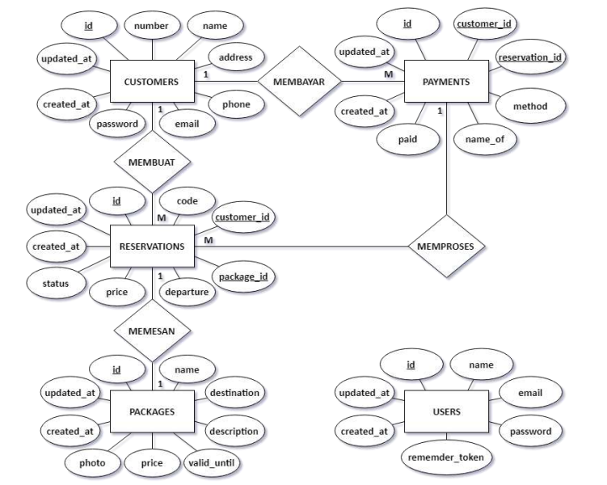
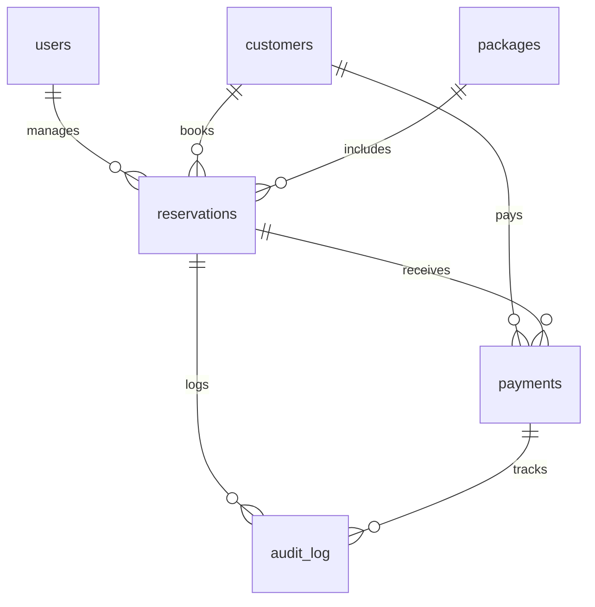

# 🛡️ Implementasi Keamanan Basis Data: Sistem Reservasi Paket Wisata

<div align="center">


 📊 Hasil Testing Lengkap

| Test ID | Test Case | Aspek Keamanan | User | Status | Hasil yang Diharapkan |
|---------|-----------|---------------|------|--------|----------------------|
| **A1** | Verifikasi Hashing | Autentikasi | admin | ✅ SUKSES | Password tersimpan sebagai hash SHA2(512), bukan plaintext |
| **A2** | Insert `jumlah_peserta = 0` | Integritas Data | admin/petugas | ❌ GAGAL | CHECK constraint mencegah data invalid |
| **B1** | UPDATE status reservasi | Otorisasi (petugas) | petugas_user | ✅ SUKSES | Petugas boleh update transaksi |
| **B2** | Verifikasi Audit Log | Audit & Akuntabilitas | petugas_user | ✅ SUKSES | Trigger mencatat user & timestamp |
| **B3** | UPDATE harga paket | Otorisasi (petugas) | petugas_user | ❌ GAGAL | Petugas tidak boleh ubah master data |
| **B4** | DROP TABLE | Otorisasi (petugas) | petugas_user | ❌ GAGAL | Petugas tidak punya hak DDL |
| **C1** | INSERT reservasi baru | Otorisasi (web_app) | web_app | ✅ SUKSES | Web app boleh buat reservasi baru |
| **C2** | UPDATE data pelanggan | Otorisasi (web_app) | web_app | ❌ GAGAL | Web app tidak boleh ubah data existing |
| **C3** | SELECT TBL_PENGGUNA | Otorisasi (web_app) | web_app | ❌ GAGAL | Web app tidak boleh akses data sensitif |

> **Catatan Penting:** 
> - ✅ **SUKSES** = Fungsi berjalan sesuai harapan (operasi berhasil atau security berfungsi)
> - ❌ **GAGAL** = Security bekerja dengan baik (mencegah operasi yang tidak diizinkan)
> 
> Kegagalan pada A2, B3, B4, C2, C3 adalah **hasil yang diinginkan** (security working as intended).=for-the-badge)


**Proyek Akhir Mata Kuliah Keamanan Basis Data**

*Mobile Commerce Tourism Reservation System dengan implementasi standar keamanan NIST & ISO 27001*

[📖 Dokumentasi](#-dokumentasi) •
[🚀 Quick Start](#-quick-start) •
[🔐 Fitur Keamanan](#-aspek-keamanan-yang-diimplementasikan) •
[🧪 Testing](#-skrip-simulasi-verifikasi)

</div>

---

## 📋 Daftar Isi

- [Tentang Proyek](#-tentang-proyek)
- [Latar Belakang](#-latar-belakang)
- [Aspek Keamanan](#-aspek-keamanan-yang-diimplementasikan)
- [Arsitektur Database](#-skema-basis-data)
- [Instalasi](#-instalasi)
- [Cara Penggunaan](#-cara-penggunaan)
- [Testing & Verifikasi](#-skrip-simulasi-verifikasi)
- [Kontributor](#-kontributor)

---

## 🎯 Tentang Proyek

Proyek ini mengimplementasikan dan mengevaluasi **aspek-aspek utama keamanan basis data** (Autentikasi, Otorisasi, Integritas, dan Audit) pada sistem reservasi paket wisata berbasis Mobile Commerce, sesuai dengan standar industri:

- ✅ **NIST SP 800-53** - Security and Privacy Controls
- ✅ **ISO 27001** - Information Security Management
- ✅ **OWASP Database Security** Best Practices

### 🎓 Tujuan Pembelajaran

Mengimplementasikan mekanisme keamanan di lapisan database (MySQL) untuk memastikan:
- **Kerahasiaan** (Confidentiality) - Perlindungan kredensial dan data sensitif
- **Integritas** (Integrity) - Konsistensi dan validitas data
- **Ketersediaan** (Availability) - Kontrol akses berbasis peran

---

## 🌟 Latar Belakang

Sistem Reservasi Paket Wisata berbasis **Mobile Commerce** sangat rentan terhadap ancaman keamanan seperti:

- 🚨 **SQL Injection** - Manipulasi query database
- 🔓 **Akses Tidak Sah** - Unauthorized access ke data sensitif
- 📊 **Penyalahgunaan Data** - Data breach dan privacy violation
- 🔄 **Inconsistent Data** - Kehilangan integritas referensial

Proyek ini mengatasi kerentanan tersebut dengan menerapkan **mekanisme keamanan berlapis** di level database MySQL, memastikan kerahasiaan, integritas, dan ketersediaan data transaksi reservasi wisata.

---

## 🔑 Aspek Keamanan yang Diimplementasikan

Proyek ini berfokus pada **empat pilar utama keamanan**, yang diimplementasikan secara langsung melalui skrip SQL (DDL, DML, DCL, Trigger):

| 🔐 Pilar Keamanan | 💻 Implementasi Teknis | 📝 Detail & Tujuan Keamanan |
|-------------------|------------------------|----------------------------|
| **1. Autentikasi** | `SHA2(512)` Password Hashing | Melindungi kredensial admin/petugas (`users`) dan customer (`customers`) dari kebocoran data. Password tidak tersimpan dalam plaintext. |
| **2. Otorisasi (Kontrol Akses)** | DCL (`GRANT`) & Prinsip Least Privilege | Membatasi hak akses setiap peran (`admin_user`, `petugas_user`, `web_app`) hanya pada tabel dan operasi yang diperlukan, mencegah akses berlebihan (NIST SP 800-53). |
| **3. Integritas Data** | `CHECK` Constraint & `FOREIGN KEY` | Menjaga kualitas data (contoh: `price >= 0`, `paid >= 0`) dan konsistensi relasi antar tabel dengan ON DELETE RESTRICT. |
| **4. Audit & Akuntabilitas** | `TRIGGER` ke `audit_log` | Mencatat setiap perubahan kritis pada transaksi (`UPDATE reservations`, `INSERT payments`), memberikan jejak audit (`mysql_user` dan `action_timestamp`) untuk akuntabilitas. |

### 🔒 Role-Based Access Control (RBAC)

```sql
-- Admin User: Full Control
GRANT ALL PRIVILEGES ON db_reservasi_wisata.* TO 'admin_user'@'localhost';

-- Petugas User: Manage Transactions & View Audit
GRANT SELECT ON db_reservasi_wisata.users TO 'petugas_user'@'localhost';
GRANT SELECT, INSERT, UPDATE ON db_reservasi_wisata.customers TO 'petugas_user'@'localhost';
GRANT SELECT, INSERT, UPDATE ON db_reservasi_wisata.reservations TO 'petugas_user'@'localhost';
GRANT SELECT, INSERT ON db_reservasi_wisata.payments TO 'petugas_user'@'localhost';
GRANT SELECT ON db_reservasi_wisata.packages TO 'petugas_user'@'localhost';
GRANT SELECT, INSERT ON db_reservasi_wisata.audit_log TO 'petugas_user'@'localhost';

-- Web App: Limited Insert Access Only
GRANT SELECT ON db_reservasi_wisata.packages TO 'web_app'@'localhost';
GRANT INSERT ON db_reservasi_wisata.customers TO 'web_app'@'localhost';
GRANT INSERT ON db_reservasi_wisata.reservations TO 'web_app'@'localhost';
GRANT INSERT ON db_reservasi_wisata.payments TO 'web_app'@'localhost';
```

## 📐 Skema Basis Data

Struktur utama sistem reservasi meliputi **6 tabel inti** dengan relasi terkelola:

### 🗂️ Entity Relationship Diagram (ERD)

<div align="center">



*Gambar 1: ERD Database Sistem Reservasi Paket Wisata Pelayaran*

</div>

### 📊 Diagram Relasi Mermaid



| Tabel | Deskripsi | Fitur Keamanan |
|-------|-----------|----------------|
| `users` | Data admin/petugas sistem internal | Password hashing SHA2(512), UNIQUE email |
| `customers` | Data customer/wisatawan yang booking | UNIQUE email & number, password hashing SHA2(512) |
| `packages` | Katalog paket wisata pelayaran | CHECK constraint `price >= 0`, destination & photo info |
| `reservations` | **Transaksi booking** (core table) | UNIQUE code, CHECK `price >= 0`, Foreign key constraints, audit trigger |
| `payments` | Data pembayaran dari customer | CHECK `paid >= 0`, Foreign key ke reservations & customers |
| `audit_log` | Log perubahan kritis | Auto-populated via trigger, mencatat USER() dan timestamp |

### 🗂️ Detail Struktur

<details>
<summary><b>Klik untuk melihat DDL lengkap</b></summary>

```sql
-- USERS: Autentikasi admin/petugas dengan SHA2(512)
CREATE TABLE users (
    id              INT PRIMARY KEY AUTO_INCREMENT,
    name            VARCHAR(100) NOT NULL,
    email           VARCHAR(100) NOT NULL UNIQUE,
    password        VARCHAR(128) NOT NULL,  -- SHA2(512) hash
    remember_token  VARCHAR(100),
    created_at      TIMESTAMP DEFAULT CURRENT_TIMESTAMP,
    updated_at      TIMESTAMP DEFAULT CURRENT_TIMESTAMP ON UPDATE CURRENT_TIMESTAMP
) ENGINE=InnoDB;

-- CUSTOMERS: Data pelanggan/wisatawan
CREATE TABLE customers (
    id          INT PRIMARY KEY AUTO_INCREMENT,
    number      VARCHAR(20) NOT NULL UNIQUE,
    name        VARCHAR(100) NOT NULL,
    address     TEXT,
    phone       VARCHAR(15) NOT NULL,
    email       VARCHAR(100) NOT NULL UNIQUE,
    password    VARCHAR(128) NOT NULL,  -- SHA2(512) hash
    created_at  TIMESTAMP DEFAULT CURRENT_TIMESTAMP,
    updated_at  TIMESTAMP DEFAULT CURRENT_TIMESTAMP ON UPDATE CURRENT_TIMESTAMP
) ENGINE=InnoDB;

-- PACKAGES: Paket wisata pelayaran
CREATE TABLE packages (
    id          INT PRIMARY KEY AUTO_INCREMENT,
    name        VARCHAR(150) NOT NULL,
    destination VARCHAR(150) NOT NULL,
    description TEXT,
    photo       VARCHAR(255),
    price       DECIMAL(10, 2) NOT NULL,
    valid_until DATE,
    created_at  TIMESTAMP DEFAULT CURRENT_TIMESTAMP,
    updated_at  TIMESTAMP DEFAULT CURRENT_TIMESTAMP ON UPDATE CURRENT_TIMESTAMP,
    CONSTRAINT chk_price_positive CHECK (price >= 0)
) ENGINE=InnoDB;

-- RESERVATIONS: Transaksi booking (Core Table)
CREATE TABLE reservations (
    id          INT PRIMARY KEY AUTO_INCREMENT,
    code        VARCHAR(50) NOT NULL UNIQUE,
    customer_id INT NOT NULL,
    package_id  INT NOT NULL,
    departure   DATE NOT NULL,
    price       DECIMAL(10, 2) NOT NULL,
    status      ENUM('Pending', 'Confirmed', 'Cancelled') DEFAULT 'Pending',
    created_at  TIMESTAMP DEFAULT CURRENT_TIMESTAMP,
    updated_at  TIMESTAMP DEFAULT CURRENT_TIMESTAMP ON UPDATE CURRENT_TIMESTAMP,
    FOREIGN KEY (customer_id) REFERENCES customers(id) ON DELETE RESTRICT ON UPDATE CASCADE,
    FOREIGN KEY (package_id) REFERENCES packages(id) ON DELETE RESTRICT ON UPDATE CASCADE,
    CONSTRAINT chk_price_reservation_positive CHECK (price >= 0)
) ENGINE=InnoDB;

-- PAYMENTS: Data pembayaran
CREATE TABLE payments (
    id              INT PRIMARY KEY AUTO_INCREMENT,
    reservation_id  INT NOT NULL,
    customer_id     INT NOT NULL,
    method          VARCHAR(50) NOT NULL,
    name_of         VARCHAR(100) NOT NULL,
    paid            DECIMAL(10, 2) NOT NULL,
    created_at      TIMESTAMP DEFAULT CURRENT_TIMESTAMP,
    updated_at      TIMESTAMP DEFAULT CURRENT_TIMESTAMP ON UPDATE CURRENT_TIMESTAMP,
    FOREIGN KEY (reservation_id) REFERENCES reservations(id) ON DELETE RESTRICT ON UPDATE CASCADE,
    FOREIGN KEY (customer_id) REFERENCES customers(id) ON DELETE RESTRICT ON UPDATE CASCADE,
    CONSTRAINT chk_paid_positive CHECK (paid >= 0)
) ENGINE=InnoDB;

-- AUDIT_LOG: Audit trail untuk akuntabilitas
CREATE TABLE audit_log (
    id                  INT PRIMARY KEY AUTO_INCREMENT,
    table_affected      VARCHAR(50),
    action              VARCHAR(10),  -- INSERT, UPDATE, DELETE
    old_data            TEXT,
    new_data            TEXT,
    action_timestamp    TIMESTAMP DEFAULT CURRENT_TIMESTAMP,
    mysql_user          VARCHAR(100)  -- Mencatat siapa yang melakukan aksi
) ENGINE=InnoDB;
```

</details>

---

## 🚀 Quick Start

### � Instalasi

#### Prasyarat
- MySQL 8.0+ atau MariaDB 10.5+
- MySQL Client (Workbench / HeidiSQL / CLI)
- Hak akses `CREATE USER` dan `GRANT PRIVILEGE`

#### Langkah Instalasi

1. **Clone repository ini**
   ```bash
   git clone https://github.com/DimasVSuper/Sistem-reservasi-paket-wisata-pelayaran.git
   cd Sistem-reservasi-paket-wisata-pelayaran
   ```

2. **Import database**
   ```bash
   mysql -u root -p < db_reservasi_wisata.sql
   ```

3. **Verifikasi instalasi**
   ```sql
   SHOW DATABASES LIKE 'db_reservasi_wisata';
   SELECT User, Host FROM mysql.user WHERE User IN ('admin_user', 'petugas_user', 'web_app');
   ```

---

## 💻 Cara Penggunaan

### 1️⃣ Setup Database & Users

Jalankan skrip SQL utama sebagai **root**:

```bash
mysql -u root -p < db_reservasi_wisata.sql
```

Skrip ini akan otomatis:
- ✅ Membuat database `db_reservasi_wisata`
- ✅ Membuat 6 tabel dengan constraint keamanan
- ✅ Mengisi data sample (pelanggan, paket wisata)
- ✅ Membuat 3 user dengan privilege berbeda
- ✅ Setup trigger audit otomatis

### 2️⃣ Login sebagai User Spesifik

```bash
# Admin - Full Access (Password: AdminPass123!)
mysql -u admin_user -p db_reservasi_wisata

# Petugas - Limited Access (Password: PetugasPass456!)
mysql -u petugas_user -p db_reservasi_wisata

# Web App - Most Restricted (Password: WebAppPass789!)
mysql -u web_app -p db_reservasi_wisata
```

> **Catatan Keamanan:** Dalam implementasi production, password harus lebih kompleks dan disimpan dalam environment variables atau secret manager.

### 3️⃣ Test Operasi Database

```sql
-- Cek paket wisata tersedia (sebagai petugas_user atau web_app)
SELECT * FROM packages WHERE valid_until >= CURDATE();

-- Buat reservasi baru (sebagai petugas_user)
INSERT INTO reservations (code, customer_id, package_id, departure, price, status)
VALUES ('RSV-2025-005', 1, 2, '2026-01-15', 5500000.00, 'Pending');

-- Update status reservasi (trigger audit akan aktif - sebagai petugas_user)
UPDATE reservations 
SET status = 'Confirmed' 
WHERE code = 'RSV-2025-005';

-- Verifikasi audit log (sebagai admin_user atau petugas_user)
SELECT * FROM audit_log 
WHERE table_affected = 'reservations' 
ORDER BY action_timestamp DESC 
LIMIT 5;
```

---

## 🧪 Skrip Simulasi (Verifikasi)

Skrip SQL terlampir mencakup **simulasi terstruktur** untuk memverifikasi bahwa Otorisasi dan Integritas telah bekerja:

### ✅ Test Case 1: Uji Kegagalan Integritas (A2)

**Tujuan:** Memverifikasi CHECK constraint bekerja

```sql
-- Login sebagai admin_user atau petugas_user
-- Harus GAGAL: price negatif (melanggar CHECK constraint)
INSERT INTO packages (name, destination, description, price, valid_until)
VALUES ('Paket Test', 'Test Destination', 'Test', -1000.00, '2025-12-31');
```

**Expected Result:** ❌ `ERROR 4025 (23000): CONSTRAINT 'chk_price_positive' failed for 'db_reservasi_wisata'.'packages'`

**Penjelasan:** Constraint `CHECK (price >= 0)` mencegah data yang tidak valid masuk ke database.

---

### ✅ Test Case 2: Uji Kegagalan Otorisasi - Petugas (B3)

**Tujuan:** Memverifikasi Least Privilege Access - petugas tidak boleh ubah harga paket

```sql
-- Login sebagai petugas_user
mysql -u petugas_user -p
USE db_reservasi_wisata;

-- Harus GAGAL: tidak memiliki privilege UPDATE pada packages
UPDATE packages 
SET price = 0.00 
WHERE id = 1;
```

**Expected Result:** ❌ `ERROR 1142 (42000): UPDATE command denied to user 'petugas_user'@'localhost' for table 'packages'`

**Penjelasan:** Petugas hanya memiliki hak SELECT pada `packages`, tidak dapat mengubah data master paket wisata.

---

### ✅ Test Case 3: Uji Kegagalan Otorisasi - Web App (C2 & C3)

**Tujuan:** Memverifikasi isolasi data sensitif dari aplikasi web

```sql
-- Login sebagai web_app
mysql -u web_app -p
USE db_reservasi_wisata;

-- Test C2: Harus GAGAL - tidak boleh UPDATE data customer existing
UPDATE customers 
SET email = 'hacker@mail.com' 
WHERE id = 1;

-- Test C3: Harus GAGAL - tidak boleh akses users (data kredensial admin)
SELECT * FROM users;
```

**Expected Result:** 
- ❌ C2: `ERROR 1142 (42000): UPDATE command denied to user 'web_app'@'localhost' for table 'customers'`
- ❌ C3: `ERROR 1142 (42000): SELECT command denied to user 'web_app'@'localhost' for table 'users'`

**Penjelasan:** Web app hanya boleh INSERT data baru (customers, reservations, payments), tidak boleh modifikasi data existing atau akses credential user internal.

---

### ✅ Test Case 4: Uji Keberhasilan Audit (B1 & B2)

**Tujuan:** Memverifikasi trigger audit logging mencatat semua perubahan kritis

```sql
-- 1. Login sebagai petugas_user dan update status reservasi (Test B1)
mysql -u petugas_user -p
USE db_reservasi_wisata;

UPDATE reservations 
SET status = 'Confirmed', price = 5500000.00 
WHERE id = 3;

-- 2. Verifikasi log tercatat (Test B2) - bisa sebagai petugas atau admin
SELECT 
    id,
    action_timestamp, 
    mysql_user, 
    table_affected, 
    action,
    old_data,
    new_data
FROM audit_log 
WHERE table_affected = 'reservations'
ORDER BY id DESC 
LIMIT 1;
```

**Expected Result:** ✅ 
```
+----+---------------------+-------------------------+-----------------+--------+
| id | action_timestamp    | mysql_user              | table_affected  | action |
+----+---------------------+-------------------------+-----------------+--------+
|  1 | 2025-10-10 14:30:15 | petugas_user@localhost  | reservations    | UPDATE |
+----+---------------------+-------------------------+-----------------+--------+
```

**Penjelasan:** Trigger `tr_reservations_update_log` otomatis mencatat perubahan status/harga reservasi, termasuk user MySQL yang melakukan perubahan untuk akuntabilitas penuh.

---

### 📊 Hasil Testing Lengkap

| Test ID | Test Case | Aspek Keamanan | User | Status | Hasil yang Diharapkan |
|---------|-----------|---------------|------|--------|----------------------|
| **A1** | Verifikasi Hashing | Autentikasi | admin | ✅ SUKSES | Password tersimpan sebagai hash SHA2(512), bukan plaintext |
| **A2** | Insert harga negatif | Integritas Data | admin/petugas | ❌ GAGAL | CHECK constraint mencegah data invalid |
| **B1** | UPDATE status reservasi | Otorisasi (petugas) | petugas_user | ✅ SUKSES | Petugas boleh update transaksi |
| **B2** | Verifikasi Audit Log | Audit & Akuntabilitas | petugas_user | ✅ SUKSES | Trigger mencatat user & timestamp |
| **B3** | UPDATE harga paket | Otorisasi (petugas) | petugas_user | ❌ GAGAL | Petugas tidak boleh ubah master data |
| **B4** | DROP TABLE | Otorisasi (petugas) | petugas_user | ❌ GAGAL | Petugas tidak punya hak DDL |
| **C1** | INSERT reservasi baru | Otorisasi (web_app) | web_app | ✅ SUKSES | Web app boleh buat reservasi baru |
| **C2** | UPDATE data customer | Otorisasi (web_app) | web_app | ❌ GAGAL | Web app tidak boleh ubah data existing |
| **C3** | SELECT users | Otorisasi (web_app) | web_app | ❌ GAGAL | Web app tidak boleh akses data sensitif |

> **Catatan Penting:** 
> - ✅ **SUKSES** = Fungsi berjalan sesuai harapan (operasi berhasil atau security berfungsi)
> - ❌ **GAGAL** = Security bekerja dengan baik (mencegah operasi yang tidak diizinkan)
> 
> Kegagalan pada A2, B3, B4, C2, C3 adalah **hasil yang diinginkan** (security working as intended).

---

## 🧪 Dokumentasi Testing & Verifikasi

Berikut adalah screenshot lengkap dari proses testing keamanan basis data:

### 📸 Test Case A: Verifikasi Hashing Password (Autentikasi)

**Screenshot Test A1:** Mengecek bahwa password tersimpan sebagai hash SHA2(512), bukan plaintext


*Gambar 2: Test A1 - Password tersimpan dalam bentuk hash SHA2(512) untuk semua user (admin, petugas, customers)*

---

### 📸 Test Case B: Pengujian Otorisasi & Audit (Petugas User)

**Screenshot Test B (Part 1):** Verifikasi kontrol akses petugas dan audit logging


*Gambar 3: Test B1-B2 - Petugas bisa UPDATE status reservasi, dan trigger audit mencatat setiap perubahan*

**Screenshot Test B (Part 2):** Uji kegagalan akses - petugas tidak boleh ubah master data


*Gambar 4: Test B3-B4 - Petugas ditolak saat coba UPDATE packages (master data) atau DROP TABLE (DDL)*

---

### 📸 Test Case C: Pengujian Otorisasi Web App (Least Privilege)

**Screenshot Test C:** Verifikasi isolasi data sensitif dari aplikasi web


*Gambar 5: Test C1-C3 - Web app boleh INSERT reservasi baru, tapi ditolak saat UPDATE data existing atau akses users table*

---

## 📚 Dokumentasi

### 📁 Struktur Proyek

```
Implementasi-Keamanan-Basis-Data-Sistem-Reservasi-Paket-Wisata/
│
├── 📄 README.md                              # Dokumentasi utama
├── 📄 ERD.png                                # Entity Relationship Diagram
├── 💾 db_reservasi_wisata.sql                # Main SQL script (550+ lines)
│
├── 📁 clean_up/                              # Folder cleanup & reset
│   ├── cleanup_database.sql                  # Drop users & database
│   └── CLEANUP_GUIDE.md                      # Panduan cleanup lengkap
│
├── 📁 testing/                               # Folder screenshot testing
│   ├── A_testing.png                         # Test autentikasi (hashing)
│   ├── B_testing_1.png                       # Test otorisasi petugas (part 1)
│   ├── B_testing_2.png                       # Test otorisasi petugas (part 2)
│   └── C_testing.png                         # Test web app least privilege
│
└── 📁 .git/                                  # Git version control
```

### 🔍 Isi File SQL Utama

File `db_reservasi_wisata.sql` berisi:

1. **DDL (Data Definition Language)** - Struktur 6 tabel dengan constraint keamanan
2. **DML (Data Manipulation Language)** - Data sample untuk testing
3. **Trigger** - Audit logging otomatis untuk akuntabilitas (2 triggers)
4. **DCL (Data Control Language)** - User creation & GRANT privileges (3 roles)
5. **Test Cases** - 9 skenario pengujian (A1-A3, B1-B4, C1-C3)
6. **Cleanup Section** - Optional uninstall commands (commented)

> **Total:** ~550+ baris SQL lengkap dengan dokumentasi

### 🔗 Referensi

- [NIST SP 800-53 - Security Controls](https://csrc.nist.gov/publications/detail/sp/800-53/rev-5/final)
- [ISO/IEC 27001 - Information Security](https://www.iso.org/isoiec-27001-information-security.html)
- [OWASP Database Security Cheat Sheet](https://cheatsheetseries.owasp.org/cheatsheets/Database_Security_Cheat_Sheet.html)
- [MySQL 8.0 Security Guide](https://dev.mysql.com/doc/refman/8.0/en/security.html)
- [Sistem-Reservasi-Wisata-Pelayaran](https://www.researchgate.net/profile/Wildan-Wiguna-2/publication/341142990_Sistem_Reservasi_Paket_Wisata_Pelayaran_Menggunakan_Mobile_Commerce_di_Kota_Bandung/links/5eb0c00945851592d6b96151/Sistem-Reservasi-Paket-Wisata-Pelayaran-Menggunakan-Mobile-Commerce-di-Kota-Bandung.pdf)

---

## 👥 Kontributor

Proyek ini dikembangkan oleh:

- **DIMAS BAYU NUGROHO** - [19240384] - Database Administrator & Project Lead
- **ICHWAN FAUZAN** - [19240621] - Tester, Documenter & Database Designer
- **RANGGA SHOLEH NUGROHO** - [19240613] - Tester & Documenter
- **SEPTIAN TIRTA WIJAYA** - [19241518] - Tester & Documenter
- **MARIO CAHYA EKA SAPUTRA** - [19240656] - Tester & Documenter

### 🤝 Kontribusi

Jika Anda menemukan bug atau ingin berkontribusi:
1. Fork repository ini
2. Buat branch baru (`git checkout -b feature/improvement`)
3. Commit perubahan (`git commit -m 'Add some improvement'`)
4. Push ke branch (`git push origin feature/improvement`)
5. Buat Pull Request

---

## 📄 Informasi Akademik

- **Mata Kuliah:** Keamanan Basis Data
- **Program Studi:** Sistem Informasi
- **Universitas:** Universitas Bina Sarana Informatika
- **Tahun Akademik:** 2025/2026
- **Dosen Pengampu:** Ahmad Nouvel, S.Kom, M.Kom

---

## 📝 Lisensi

Proyek ini dibuat untuk keperluan akademik dan pembelajaran. Tidak diperuntukkan untuk penggunaan komersial.

---

<div align="center">

**⭐ Jika proyek ini membantu, berikan bintang di repository!**

Made with ❤️


</div>
