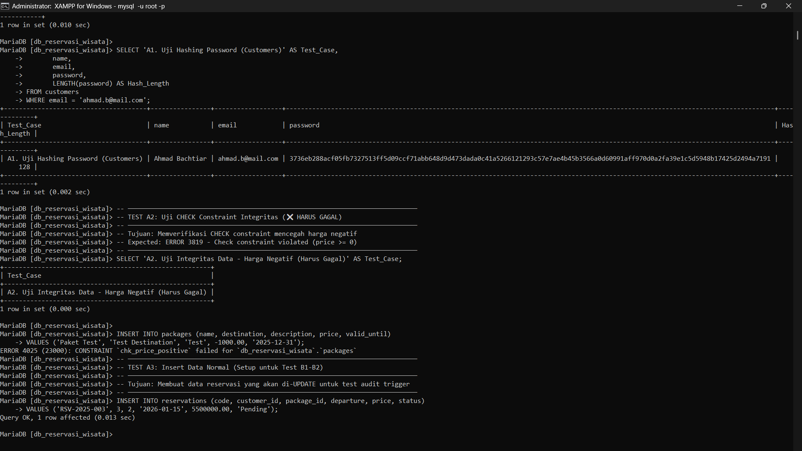
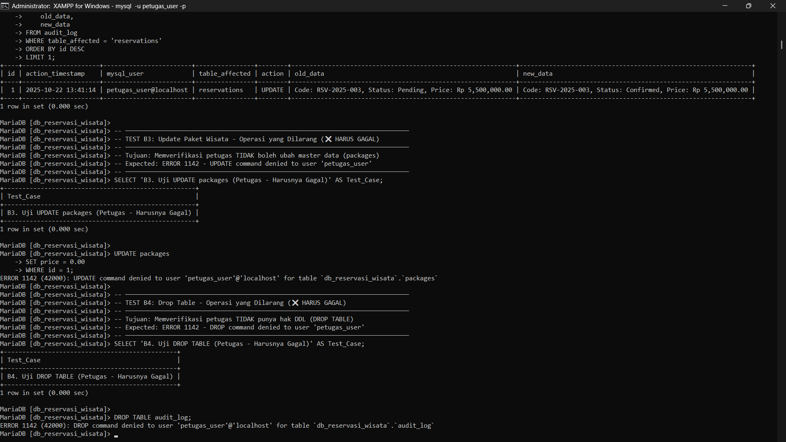

# 🛡️ Implementasi Keamanan Basis Data: Sistem Reservasi Paket Wisata# 🛡️ Implementasi Keamanan Basis Data: Sistem Reservasi Paket Wisata


<div align="center"><div align="center">


 📊 Hasil Testing Lengkap


| Test ID | Test Case | Aspek Keamanan | User | Status | Hasil yang Diharapkan |

**Proyek Akhir Mata Kuliah Keamanan Basis Data**|---------|-----------|---------------|------|--------|----------------------|

| **A1** | Verifikasi Hashing | Autentikasi | admin | ✅ SUKSES | Password tersimpan sebagai hash SHA2(512), bukan plaintext |

*Mobile Commerce Tourism Reservation System dengan implementasi standar keamanan NIST & ISO 27001*| **A2** | Insert `jumlah_peserta = 0` | Integritas Data | admin/petugas | ❌ GAGAL | CHECK constraint mencegah data invalid |

| **B1** | UPDATE status reservasi | Otorisasi (petugas) | petugas_user | ✅ SUKSES | Petugas boleh update transaksi |

[📖 Dokumentasi](#-dokumentasi) • [🚀 Quick Start](#-quick-start) • [🔐 Keamanan](#-aspek-keamanan-yang-diimplementasikan) • [🧪 Testing](#-testing--verifikasi) • [📁 Struktur](#-struktur-project)| **B2** | Verifikasi Audit Log | Audit & Akuntabilitas | petugas_user | ✅ SUKSES | Trigger mencatat user & timestamp |

| **B3** | UPDATE harga paket | Otorisasi (petugas) | petugas_user | ❌ GAGAL | Petugas tidak boleh ubah master data |

</div>| **B4** | DROP TABLE | Otorisasi (petugas) | petugas_user | ❌ GAGAL | Petugas tidak punya hak DDL |

| **C1** | INSERT reservasi baru | Otorisasi (web_app) | web_app | ✅ SUKSES | Web app boleh buat reservasi baru |

---| **C2** | UPDATE data pelanggan | Otorisasi (web_app) | web_app | ❌ GAGAL | Web app tidak boleh ubah data existing |

| **C3** | SELECT TBL_PENGGUNA | Otorisasi (web_app) | web_app | ❌ GAGAL | Web app tidak boleh akses data sensitif |

## 📋 Daftar Isi

> **Catatan Penting:** 

- [Tentang Proyek](#-tentang-proyek)> - ✅ **SUKSES** = Fungsi berjalan sesuai harapan (operasi berhasil atau security berfungsi)

- [Latar Belakang](#-latar-belakang)> - ❌ **GAGAL** = Security bekerja dengan baik (mencegah operasi yang tidak diizinkan)

- [Aspek Keamanan](#-aspek-keamanan-yang-diimplementasikan)> 

- [Database Schema](#-database-schema)> Kegagalan pada A2, B3, B4, C2, C3 adalah **hasil yang diinginkan** (security working as intended).=for-the-badge)

- [Instalasi](#-instalasi)

- [Penggunaan](#-cara-penggunaan)

- [Testing & Verifikasi](#-testing--verifikasi)**Proyek Akhir Mata Kuliah Keamanan Basis Data**

- [Struktur Project](#-struktur-project)

- [Kontributor](#-kontributor)*Mobile Commerce Tourism Reservation System dengan implementasi standar keamanan NIST & ISO 27001*


---[📖 Dokumentasi](#-dokumentasi) •

[🚀 Quick Start](#-quick-start) •

## 🎯 Tentang Proyek[🔐 Fitur Keamanan](#-aspek-keamanan-yang-diimplementasikan) •

[🧪 Testing](#-skrip-simulasi-verifikasi)

Proyek ini mengimplementasikan dan mengevaluasi **4 pilar utama keamanan basis data** pada sistem reservasi paket wisata berbasis Mobile Commerce:

</div>

- **Autentikasi** - SHA2(512) Password Hashing

- **Otorisasi** - Role-Based Access Control (RBAC)---

- **Integritas** - CHECK Constraints & Foreign Keys

- **Audit** - Trigger Logging untuk Akuntabilitas## 📋 Daftar Isi


Standar implementasi mengacu pada:- [Tentang Proyek](#-tentang-proyek)

- ✅ **NIST SP 800-53** - Security and Privacy Controls- [Latar Belakang](#-latar-belakang)

- ✅ **ISO 27001** - Information Security Management- [Aspek Keamanan](#-aspek-keamanan-yang-diimplementasikan)

- ✅ **OWASP Database Security** Best Practices- [Arsitektur Database](#-skema-basis-data)

- [Instalasi](#-instalasi)

---- [Cara Penggunaan](#-cara-penggunaan)

- [Testing & Verifikasi](#-skrip-simulasi-verifikasi)

## 🌟 Latar Belakang- [Kontributor](#-kontributor)


Sistem Reservasi Paket Wisata berbasis **Mobile Commerce** sangat rentan terhadap ancaman keamanan:---


| Ancaman | Deskripsi |## 🎯 Tentang Proyek

|---------|-----------|

| 🚨 **SQL Injection** | Manipulasi query database oleh attacker |Proyek ini mengimplementasikan dan mengevaluasi **aspek-aspek utama keamanan basis data** (Autentikasi, Otorisasi, Integritas, dan Audit) pada sistem reservasi paket wisata berbasis Mobile Commerce, sesuai dengan standar industri:

| 🔓 **Unauthorized Access** | Akses tidak sah ke data sensitif |

| 📊 **Data Breach** | Penyalahgunaan dan kebocoran data |- ✅ **NIST SP 800-53** - Security and Privacy Controls

| 🔄 **Data Inconsistency** | Kehilangan integritas referensial |- ✅ **ISO 27001** - Information Security Management

- ✅ **OWASP Database Security** Best Practices

Proyek ini mengatasi kerentanan tersebut dengan menerapkan **mekanisme keamanan berlapis** di level database MySQL.

### 🎓 Tujuan Pembelajaran

---

Mengimplementasikan mekanisme keamanan di lapisan database (MySQL) untuk memastikan:

## 🔑 Aspek Keamanan yang Diimplementasikan- **Kerahasiaan** (Confidentiality) - Perlindungan kredensial dan data sensitif

- **Integritas** (Integrity) - Konsistensi dan validitas data

| 🔐 Pilar Keamanan | 💻 Implementasi | 📝 Deskripsi |- **Ketersediaan** (Availability) - Kontrol akses berbasis peran

|-------------------|-----------------|-------------|

| **1. Autentikasi** | SHA2(512) Hashing | Kredensial admin/petugas/customer dilindungi dengan hashing |---

| **2. Otorisasi** | RBAC + GRANT DCL | 3 role dengan privilege berbeda: admin_user, petugas_user, web_app |

| **3. Integritas** | CHECK + FOREIGN KEY | Validasi data & relasi antar tabel dijaga dengan constraint |## 🌟 Latar Belakang

| **4. Audit** | TRIGGER + audit_log | Setiap perubahan kritis dicatat otomatis untuk akuntabilitas |

Sistem Reservasi Paket Wisata berbasis **Mobile Commerce** sangat rentan terhadap ancaman keamanan seperti:

### 🔒 Role-Based Access Control (RBAC)

- 🚨 **SQL Injection** - Manipulasi query database

```sql- 🔓 **Akses Tidak Sah** - Unauthorized access ke data sensitif

-- 1. Admin User: Full Control (DBA)- 📊 **Penyalahgunaan Data** - Data breach dan privacy violation

GRANT ALL PRIVILEGES ON db_reservasi_wisata.* TO 'admin_user'@'localhost';- 🔄 **Inconsistent Data** - Kehilangan integritas referensial


-- 2. Petugas User: Transaction Management (Least Privilege)Proyek ini mengatasi kerentanan tersebut dengan menerapkan **mekanisme keamanan berlapis** di level database MySQL, memastikan kerahasiaan, integritas, dan ketersediaan data transaksi reservasi wisata.

GRANT SELECT ON db_reservasi_wisata.users TO 'petugas_user'@'localhost';

GRANT SELECT, INSERT, UPDATE ON db_reservasi_wisata.customers TO 'petugas_user'@'localhost';---

GRANT SELECT, INSERT, UPDATE ON db_reservasi_wisata.reservations TO 'petugas_user'@'localhost';

GRANT SELECT, INSERT ON db_reservasi_wisata.payments TO 'petugas_user'@'localhost';## 🔑 Aspek Keamanan yang Diimplementasikan

GRANT SELECT ON db_reservasi_wisata.packages TO 'petugas_user'@'localhost';

GRANT SELECT, INSERT ON db_reservasi_wisata.audit_log TO 'petugas_user'@'localhost';Proyek ini berfokus pada **empat pilar utama keamanan**, yang diimplementasikan secara langsung melalui skrip SQL (DDL, DML, DCL, Trigger):


-- 3. Web App: Customer Self-Service (Most Restricted)| 🔐 Pilar Keamanan | 💻 Implementasi Teknis | 📝 Detail & Tujuan Keamanan |

GRANT SELECT ON db_reservasi_wisata.packages TO 'web_app'@'localhost';|-------------------|------------------------|----------------------------|

GRANT INSERT ON db_reservasi_wisata.customers TO 'web_app'@'localhost';| **1. Autentikasi** | `SHA2(512)` Password Hashing | Melindungi kredensial admin/petugas (`users`) dan customer (`customers`) dari kebocoran data. Password tidak tersimpan dalam plaintext. |

GRANT INSERT ON db_reservasi_wisata.reservations TO 'web_app'@'localhost';| **2. Otorisasi (Kontrol Akses)** | DCL (`GRANT`) & Prinsip Least Privilege | Membatasi hak akses setiap peran (`admin_user`, `petugas_user`, `web_app`) hanya pada tabel dan operasi yang diperlukan, mencegah akses berlebihan (NIST SP 800-53). |

GRANT INSERT ON db_reservasi_wisata.payments TO 'web_app'@'localhost';| **3. Integritas Data** | `CHECK` Constraint & `FOREIGN KEY` | Menjaga kualitas data (contoh: `price >= 0`, `paid >= 0`) dan konsistensi relasi antar tabel dengan ON DELETE RESTRICT. |

```| **4. Audit & Akuntabilitas** | `TRIGGER` ke `audit_log` | Mencatat setiap perubahan kritis pada transaksi (`UPDATE reservations`, `INSERT payments`), memberikan jejak audit (`mysql_user` dan `action_timestamp`) untuk akuntabilitas. |


---### 🔒 Role-Based Access Control (RBAC)


## 📐 Database Schema```sql

-- Admin User: Full Control

### 🗂️ Entity Relationship DiagramGRANT ALL PRIVILEGES ON db_reservasi_wisata.* TO 'admin_user'@'localhost';


<div align="center">-- Petugas User: Manage Transactions & View Audit

GRANT SELECT ON db_reservasi_wisata.users TO 'petugas_user'@'localhost';

GRANT SELECT, INSERT, UPDATE ON db_reservasi_wisata.customers TO 'petugas_user'@'localhost';

GRANT SELECT, INSERT, UPDATE ON db_reservasi_wisata.reservations TO 'petugas_user'@'localhost';

*Gambar 1: ERD dengan 6 tabel inti dan relasi terkelola*GRANT SELECT, INSERT ON db_reservasi_wisata.payments TO 'petugas_user'@'localhost';

GRANT SELECT ON db_reservasi_wisata.packages TO 'petugas_user'@'localhost';

</div>GRANT SELECT, INSERT ON db_reservasi_wisata.audit_log TO 'petugas_user'@'localhost';


### 📊 Tabel Inti-- Web App: Limited Insert Access Only

GRANT SELECT ON db_reservasi_wisata.packages TO 'web_app'@'localhost';

| Tabel | Fungsi | Fitur Keamanan |GRANT INSERT ON db_reservasi_wisata.customers TO 'web_app'@'localhost';

|-------|--------|----------------|GRANT INSERT ON db_reservasi_wisata.reservations TO 'web_app'@'localhost';

| `users` | Kredensial admin/petugas | Password SHA2(512), UNIQUE email |GRANT INSERT ON db_reservasi_wisata.payments TO 'web_app'@'localhost';

| `customers` | Data pelanggan/wisatawan | Password SHA2(512), UNIQUE email & number |```

| `packages` | Katalog paket wisata | CHECK price >= 0, destination info |

| `reservations` | **Core** - Transaksi booking | UNIQUE code, FK constraints, audit trigger |## 📐 Skema Basis Data

| `payments` | Data pembayaran | CHECK paid >= 0, FK ke reservations |

| `audit_log` | Jejak perubahan kritis | Auto-populated via trigger, mencatat USER() |Struktur utama sistem reservasi meliputi **6 tabel inti** dengan relasi terkelola:


### 📋 DDL Summary### 🗂️ Entity Relationship Diagram (ERD)


<details><div align="center">

<summary><b>Klik untuk melihat DDL lengkap</b></summary>


```sql

-- USERS TABLE*Gambar 1: ERD Database Sistem Reservasi Paket Wisata Pelayaran*

CREATE TABLE users (

    id              INT PRIMARY KEY AUTO_INCREMENT,</div>

    name            VARCHAR(100) NOT NULL,

    email           VARCHAR(100) NOT NULL UNIQUE,### 📊 Diagram Relasi Mermaid

    password        VARCHAR(128) NOT NULL,  -- SHA2(512)

    remember_token  VARCHAR(100),```mermaid

    created_at      TIMESTAMP DEFAULT CURRENT_TIMESTAMP,erDiagram

    updated_at      TIMESTAMP DEFAULT CURRENT_TIMESTAMP ON UPDATE CURRENT_TIMESTAMP    users ||--o{ reservations : manages

) ENGINE=InnoDB;    customers ||--o{ reservations : books

    customers ||--o{ payments : pays

-- CUSTOMERS TABLE    packages ||--o{ reservations : includes

CREATE TABLE customers (    reservations ||--o{ payments : receives

    id          INT PRIMARY KEY AUTO_INCREMENT,    reservations ||--o{ audit_log : logs

    number      VARCHAR(20) NOT NULL UNIQUE,    payments ||--o{ audit_log : tracks

    name        VARCHAR(100) NOT NULL,```

    address     TEXT,

    phone       VARCHAR(15) NOT NULL,| Tabel | Deskripsi | Fitur Keamanan |

    email       VARCHAR(100) NOT NULL UNIQUE,|-------|-----------|----------------|

    password    VARCHAR(128) NOT NULL,  -- SHA2(512)| `users` | Data admin/petugas sistem internal | Password hashing SHA2(512), UNIQUE email |

    created_at  TIMESTAMP DEFAULT CURRENT_TIMESTAMP,| `customers` | Data customer/wisatawan yang booking | UNIQUE email & number, password hashing SHA2(512) |

    updated_at  TIMESTAMP DEFAULT CURRENT_TIMESTAMP ON UPDATE CURRENT_TIMESTAMP| `packages` | Katalog paket wisata pelayaran | CHECK constraint `price >= 0`, destination & photo info |

) ENGINE=InnoDB;| `reservations` | **Transaksi booking** (core table) | UNIQUE code, CHECK `price >= 0`, Foreign key constraints, audit trigger |

| `payments` | Data pembayaran dari customer | CHECK `paid >= 0`, Foreign key ke reservations & customers |

-- PACKAGES TABLE| `audit_log` | Log perubahan kritis | Auto-populated via trigger, mencatat USER() dan timestamp |

CREATE TABLE packages (

    id          INT PRIMARY KEY AUTO_INCREMENT,### 🗂️ Detail Struktur

    name        VARCHAR(150) NOT NULL,

    destination VARCHAR(150) NOT NULL,<details>

    description TEXT,<summary><b>Klik untuk melihat DDL lengkap</b></summary>

    photo       VARCHAR(255),

    price       DECIMAL(10, 2) NOT NULL,```sql

    valid_until DATE,-- USERS: Autentikasi admin/petugas dengan SHA2(512)

    created_at  TIMESTAMP DEFAULT CURRENT_TIMESTAMP,CREATE TABLE users (

    updated_at  TIMESTAMP DEFAULT CURRENT_TIMESTAMP ON UPDATE CURRENT_TIMESTAMP,    id              INT PRIMARY KEY AUTO_INCREMENT,

    CONSTRAINT chk_price_positive CHECK (price >= 0)    name            VARCHAR(100) NOT NULL,

) ENGINE=InnoDB;    email           VARCHAR(100) NOT NULL UNIQUE,

    password        VARCHAR(128) NOT NULL,  -- SHA2(512) hash

-- RESERVATIONS TABLE (CORE)    remember_token  VARCHAR(100),

CREATE TABLE reservations (    created_at      TIMESTAMP DEFAULT CURRENT_TIMESTAMP,

    id          INT PRIMARY KEY AUTO_INCREMENT,    updated_at      TIMESTAMP DEFAULT CURRENT_TIMESTAMP ON UPDATE CURRENT_TIMESTAMP

    code        VARCHAR(50) NOT NULL UNIQUE,) ENGINE=InnoDB;

    customer_id INT NOT NULL,

    package_id  INT NOT NULL,-- CUSTOMERS: Data pelanggan/wisatawan

    departure   DATE NOT NULL,CREATE TABLE customers (

    price       DECIMAL(10, 2) NOT NULL,    id          INT PRIMARY KEY AUTO_INCREMENT,

    status      ENUM('Pending', 'Confirmed', 'Cancelled') DEFAULT 'Pending',    number      VARCHAR(20) NOT NULL UNIQUE,

    created_at  TIMESTAMP DEFAULT CURRENT_TIMESTAMP,    name        VARCHAR(100) NOT NULL,

    updated_at  TIMESTAMP DEFAULT CURRENT_TIMESTAMP ON UPDATE CURRENT_TIMESTAMP,    address     TEXT,

    FOREIGN KEY (customer_id) REFERENCES customers(id) ON DELETE RESTRICT,    phone       VARCHAR(15) NOT NULL,

    FOREIGN KEY (package_id) REFERENCES packages(id) ON DELETE RESTRICT,    email       VARCHAR(100) NOT NULL UNIQUE,

    CONSTRAINT chk_price_reservation_positive CHECK (price >= 0)    password    VARCHAR(128) NOT NULL,  -- SHA2(512) hash

) ENGINE=InnoDB;    created_at  TIMESTAMP DEFAULT CURRENT_TIMESTAMP,

    updated_at  TIMESTAMP DEFAULT CURRENT_TIMESTAMP ON UPDATE CURRENT_TIMESTAMP

-- PAYMENTS TABLE) ENGINE=InnoDB;

CREATE TABLE payments (

    id              INT PRIMARY KEY AUTO_INCREMENT,-- PACKAGES: Paket wisata pelayaran

    reservation_id  INT NOT NULL,CREATE TABLE packages (

    customer_id     INT NOT NULL,    id          INT PRIMARY KEY AUTO_INCREMENT,

    method          VARCHAR(50) NOT NULL,    name        VARCHAR(150) NOT NULL,

    name_of         VARCHAR(100) NOT NULL,    destination VARCHAR(150) NOT NULL,

    paid            DECIMAL(10, 2) NOT NULL,    description TEXT,

    created_at      TIMESTAMP DEFAULT CURRENT_TIMESTAMP,    photo       VARCHAR(255),

    updated_at      TIMESTAMP DEFAULT CURRENT_TIMESTAMP ON UPDATE CURRENT_TIMESTAMP,    price       DECIMAL(10, 2) NOT NULL,

    FOREIGN KEY (reservation_id) REFERENCES reservations(id) ON DELETE RESTRICT,    valid_until DATE,

    FOREIGN KEY (customer_id) REFERENCES customers(id) ON DELETE RESTRICT,    created_at  TIMESTAMP DEFAULT CURRENT_TIMESTAMP,

    CONSTRAINT chk_paid_positive CHECK (paid >= 0)    updated_at  TIMESTAMP DEFAULT CURRENT_TIMESTAMP ON UPDATE CURRENT_TIMESTAMP,

) ENGINE=InnoDB;    CONSTRAINT chk_price_positive CHECK (price >= 0)

) ENGINE=InnoDB;

-- AUDIT_LOG TABLE

CREATE TABLE audit_log (-- RESERVATIONS: Transaksi booking (Core Table)

    id                  INT PRIMARY KEY AUTO_INCREMENT,CREATE TABLE reservations (

    table_affected      VARCHAR(50),    id          INT PRIMARY KEY AUTO_INCREMENT,

    action              VARCHAR(10),    code        VARCHAR(50) NOT NULL UNIQUE,

    old_data            TEXT,    customer_id INT NOT NULL,

    new_data            TEXT,    package_id  INT NOT NULL,

    action_timestamp    TIMESTAMP DEFAULT CURRENT_TIMESTAMP,    departure   DATE NOT NULL,

    mysql_user          VARCHAR(100)    price       DECIMAL(10, 2) NOT NULL,

) ENGINE=InnoDB;    status      ENUM('Pending', 'Confirmed', 'Cancelled') DEFAULT 'Pending',

```    created_at  TIMESTAMP DEFAULT CURRENT_TIMESTAMP,

    updated_at  TIMESTAMP DEFAULT CURRENT_TIMESTAMP ON UPDATE CURRENT_TIMESTAMP,

</details>    FOREIGN KEY (customer_id) REFERENCES customers(id) ON DELETE RESTRICT ON UPDATE CASCADE,

    FOREIGN KEY (package_id) REFERENCES packages(id) ON DELETE RESTRICT ON UPDATE CASCADE,

---    CONSTRAINT chk_price_reservation_positive CHECK (price >= 0)

) ENGINE=InnoDB;

## 🚀 Instalasi

-- PAYMENTS: Data pembayaran

### ✅ PrasyaratCREATE TABLE payments (

    id              INT PRIMARY KEY AUTO_INCREMENT,

- MySQL 8.0+ atau MariaDB 10.5+    reservation_id  INT NOT NULL,

- MySQL Client (CLI/Workbench/HeidiSQL)    customer_id     INT NOT NULL,

- Akses root untuk setup database & users    method          VARCHAR(50) NOT NULL,

    name_of         VARCHAR(100) NOT NULL,

### 📥 Langkah-Langkah    paid            DECIMAL(10, 2) NOT NULL,

    created_at      TIMESTAMP DEFAULT CURRENT_TIMESTAMP,

**1. Clone repository**    updated_at      TIMESTAMP DEFAULT CURRENT_TIMESTAMP ON UPDATE CURRENT_TIMESTAMP,

    FOREIGN KEY (reservation_id) REFERENCES reservations(id) ON DELETE RESTRICT ON UPDATE CASCADE,

```bash    FOREIGN KEY (customer_id) REFERENCES customers(id) ON DELETE RESTRICT ON UPDATE CASCADE,

git clone https://github.com/DimasVSuper/Implementasi-Keamanan-Basis-Data-Sistem-Reservasi-Paket-Wisata.git    CONSTRAINT chk_paid_positive CHECK (paid >= 0)

cd Implementasi-Keamanan-Basis-Data-Sistem-Reservasi-Paket-Wisata) ENGINE=InnoDB;

```

-- AUDIT_LOG: Audit trail untuk akuntabilitas

**2. Import database (sebagai root)**CREATE TABLE audit_log (

    id                  INT PRIMARY KEY AUTO_INCREMENT,

```bash    table_affected      VARCHAR(50),

mysql -u root -p < db_reservasi_wisata.sql    action              VARCHAR(10),  -- INSERT, UPDATE, DELETE

```    old_data            TEXT,

    new_data            TEXT,

**3. Verifikasi instalasi**    action_timestamp    TIMESTAMP DEFAULT CURRENT_TIMESTAMP,

    mysql_user          VARCHAR(100)  -- Mencatat siapa yang melakukan aksi

```bash) ENGINE=InnoDB;

# Cek database```

mysql -u root -p -e "SHOW DATABASES LIKE 'db_reservasi_wisata';"

</details>

# Cek users

mysql -u root -p -e "SELECT User, Host FROM mysql.user WHERE User IN ('admin_user', 'petugas_user', 'web_app');"---


# Cek tabel## 🚀 Quick Start

mysql -u root -p db_reservasi_wisata -e "SHOW TABLES;"

```### � Instalasi


> **Installer otomatis:**#### Prasyarat

> - ✅ Membuat database `db_reservasi_wisata`- MySQL 8.0+ atau MariaDB 10.5+

> - ✅ Membuat 6 tabel dengan constraint keamanan- MySQL Client (Workbench / HeidiSQL / CLI)

> - ✅ Insert data sample (3 customers, 3 packages)- Hak akses `CREATE USER` dan `GRANT PRIVILEGE`

> - ✅ Create 3 users dengan privilege berbeda

> - ✅ Setup 2 triggers untuk audit logging#### Langkah Instalasi


---1. **Clone repository ini**

   ```bash

## 💻 Cara Penggunaan   git clone https://github.com/DimasVSuper/Sistem-reservasi-paket-wisata-pelayaran.git

   cd Sistem-reservasi-paket-wisata-pelayaran

### 1️⃣ Login dengan User Spesifik   ```


```bash2. **Import database**

# Admin (Password: AdminPass123!)   ```bash

mysql -u admin_user -p db_reservasi_wisata   mysql -u root -p < db_reservasi_wisata.sql

   ```

# Petugas (Password: PetugasPass456!)

mysql -u petugas_user -p db_reservasi_wisata3. **Verifikasi instalasi**

   ```sql

# Web App (Password: WebAppPass789!)   SHOW DATABASES LIKE 'db_reservasi_wisata';

mysql -u web_app -p db_reservasi_wisata   SELECT User, Host FROM mysql.user WHERE User IN ('admin_user', 'petugas_user', 'web_app');

```   ```


### 2️⃣ Operasi Database---


```sql## 💻 Cara Penggunaan

-- ✅ Cek paket wisata tersedia

SELECT * FROM packages WHERE valid_until >= CURDATE();### 1️⃣ Setup Database & Users


-- ✅ Buat reservasi baru (sebagai petugas_user)Jalankan skrip SQL utama sebagai **root**:

INSERT INTO reservations (code, customer_id, package_id, departure, price, status)

VALUES ('RSV-2025-005', 1, 2, '2026-01-15', 5500000.00, 'Pending');```bash

mysql -u root -p < db_reservasi_wisata.sql

-- ✅ Update status (trigger audit aktif)```

UPDATE reservations 

SET status = 'Confirmed' Skrip ini akan otomatis:

WHERE code = 'RSV-2025-005';- ✅ Membuat database `db_reservasi_wisata`

- ✅ Membuat 6 tabel dengan constraint keamanan

-- ✅ Verifikasi audit log- ✅ Mengisi data sample (pelanggan, paket wisata)

SELECT * FROM audit_log - ✅ Membuat 3 user dengan privilege berbeda

WHERE table_affected = 'reservations' - ✅ Setup trigger audit otomatis

ORDER BY action_timestamp DESC LIMIT 5;

```### 2️⃣ Login sebagai User Spesifik


### 3️⃣ Test Security Features```bash

# Admin - Full Access (Password: AdminPass123!)

```sqlmysql -u admin_user -p db_reservasi_wisata

-- ❌ Coba insert harga negatif (CHECK constraint akan mencegah)

INSERT INTO packages (name, destination, description, price, valid_until)# Petugas - Limited Access (Password: PetugasPass456!)

VALUES ('Test', 'Test', 'Test', -1000.00, '2025-12-31');mysql -u petugas_user -p db_reservasi_wisata


-- ❌ Sebagai petugas, coba update harga paket (akan ditolak - Least Privilege)# Web App - Most Restricted (Password: WebAppPass789!)

UPDATE packages SET price = 0.00 WHERE id = 1;mysql -u web_app -p db_reservasi_wisata

```

-- ❌ Sebagai web_app, coba lihat users table (akan ditolak - Access Control)

SELECT * FROM users;> **Catatan Keamanan:** Dalam implementasi production, password harus lebih kompleks dan disimpan dalam environment variables atau secret manager.

```

### 3️⃣ Test Operasi Database

---

```sql

## 🧪 Testing & Verifikasi-- Cek paket wisata tersedia (sebagai petugas_user atau web_app)

SELECT * FROM packages WHERE valid_until >= CURDATE();

### 📸 Screenshot Testing

-- Buat reservasi baru (sebagai petugas_user)

#### **Test Case A: Autentikasi - Password Hashing**INSERT INTO reservations (code, customer_id, package_id, departure, price, status)

VALUES ('RSV-2025-005', 1, 2, '2026-01-15', 5500000.00, 'Pending');



-- Update status reservasi (trigger audit akan aktif - sebagai petugas_user)

*Test A1: Password tersimpan sebagai SHA2(512) hash, bukan plaintext*UPDATE reservations 

SET status = 'Confirmed' 

---WHERE code = 'RSV-2025-005';


#### **Test Case B: Otorisasi & Audit - Petugas User**-- Verifikasi audit log (sebagai admin_user atau petugas_user)

SELECT * FROM audit_log 

WHERE table_affected = 'reservations' 

ORDER BY action_timestamp DESC 

*Test B1-B2: Petugas bisa UPDATE reservasi, trigger audit mencatat setiap perubahan*LIMIT 5;

```



---

*Test B3-B4: Petugas ditolak UPDATE packages & DROP TABLE (Least Privilege)*

## 🧪 Skrip Simulasi (Verifikasi)

---

Skrip SQL terlampir mencakup **simulasi terstruktur** untuk memverifikasi bahwa Otorisasi dan Integritas telah bekerja:

#### **Test Case C: Otorisasi - Web App User**

### ✅ Test Case 1: Uji Kegagalan Integritas (A2)


**Tujuan:** Memverifikasi CHECK constraint bekerja

*Test C1-C3: Web app bisa INSERT, tapi ditolak UPDATE & SELECT users*

```sql

----- Login sebagai admin_user atau petugas_user

-- Harus GAGAL: price negatif (melanggar CHECK constraint)

### 📊 Hasil Testing RingkasINSERT INTO packages (name, destination, description, price, valid_until)

VALUES ('Paket Test', 'Test Destination', 'Test', -1000.00, '2025-12-31');

| ID | Test Case | Aspek | User | Status | Hasil |```

|----|-----------|----- |------|--------|-------|

| A1 | Verifikasi Hashing | Autentikasi | admin | ✅ | Password = SHA2(512) hash |**Expected Result:** ❌ `ERROR 4025 (23000): CONSTRAINT 'chk_price_positive' failed for 'db_reservasi_wisata'.'packages'`

| A2 | Insert Harga Negatif | Integritas | admin | ❌ | CHECK constraint mencegah |

| B1 | UPDATE Reservasi | Otorisasi | petugas | ✅ | Petugas boleh update status |**Penjelasan:** Constraint `CHECK (price >= 0)` mencegah data yang tidak valid masuk ke database.

| B2 | Verifikasi Audit | Audit | petugas | ✅ | Trigger mencatat perubahan |

| B3 | UPDATE Packages | Otorisasi | petugas | ❌ | Ditolak - master data read-only |---

| B4 | DROP TABLE | Otorisasi | petugas | ❌ | Ditolak - no DDL privilege |

| C1 | INSERT Reservasi | Otorisasi | web_app | ✅ | Web app bisa buat reservasi |### ✅ Test Case 2: Uji Kegagalan Otorisasi - Petugas (B3)

| C2 | UPDATE Customer | Otorisasi | web_app | ❌ | Ditolak - no UPDATE privilege |

| C3 | SELECT Users | Otorisasi | web_app | ❌ | Ditolak - tidak akses kredensial |**Tujuan:** Memverifikasi Least Privilege Access - petugas tidak boleh ubah harga paket


> **Interpretasi:**```sql

> - ✅ **SUKSES** = Operasi berhasil atau security berfungsi dengan baik-- Login sebagai petugas_user

> - ❌ **GAGAL** = Security mencegah akses (hasil yang diinginkan!)mysql -u petugas_user -p

USE db_reservasi_wisata;

---

-- Harus GAGAL: tidak memiliki privilege UPDATE pada packages

## 📁 Struktur ProjectUPDATE packages 

SET price = 0.00 

```WHERE id = 1;

Implementasi-Keamanan-Basis-Data-Sistem-Reservasi-Paket-Wisata/```

│

├── 📄 README.md                          # Dokumentasi (file ini)**Expected Result:** ❌ `ERROR 1142 (42000): UPDATE command denied to user 'petugas_user'@'localhost' for table 'packages'`

├── 📄 ERD.png                            # Entity Relationship Diagram

│**Penjelasan:** Petugas hanya memiliki hak SELECT pada `packages`, tidak dapat mengubah data master paket wisata.

├── 💾 db_reservasi_wisata.sql            # Main SQL script (550+ lines)

│   ├── Section 1: DDL (6 tables + constraints)---

│   ├── Section 2: DML (sample data)

│   ├── Section 3: Triggers (audit logging)### ✅ Test Case 3: Uji Kegagalan Otorisasi - Web App (C2 & C3)

│   ├── Section 4: DCL (users & privileges)

│   └── Section 5: Test cases**Tujuan:** Memverifikasi isolasi data sensitif dari aplikasi web

│

├── 📁 clean_up/                          # Cleanup & Reset Scripts```sql

│   ├── cleanup_database.sql              # Drop users & database-- Login sebagai web_app

│   └── CLEANUP_GUIDE.md                  # Panduan cleanup lengkapmysql -u web_app -p

│USE db_reservasi_wisata;

├── 📁 testing/                           # Screenshots & Documentation

│   ├── A_testing.png                     # Test autentikasi (hashing)-- Test C2: Harus GAGAL - tidak boleh UPDATE data customer existing

│   ├── B_Testing_1.png                   # Test otorisasi petugas (part 1)UPDATE customers 

│   ├── B_testing_2.png                   # Test otorisasi petugas (part 2)SET email = 'hacker@mail.com' 

│   └── C_Testing.png                     # Test web app least privilegeWHERE id = 1;

│

└── 📁 .git/                              # Version control-- Test C3: Harus GAGAL - tidak boleh akses users (data kredensial admin)

```SELECT * FROM users;

```

---

**Expected Result:** 

## 📚 Dokumentasi Lengkap- ❌ C2: `ERROR 1142 (42000): UPDATE command denied to user 'web_app'@'localhost' for table 'customers'`

- ❌ C3: `ERROR 1142 (42000): SELECT command denied to user 'web_app'@'localhost' for table 'users'`

### 🔍 File SQL (`db_reservasi_wisata.sql`)

**Penjelasan:** Web app hanya boleh INSERT data baru (customers, reservations, payments), tidak boleh modifikasi data existing atau akses credential user internal.

**Struktur:** ~550+ baris dengan dokumentasi inline

---

```

SECTION 1: DDL (Data Definition Language)### ✅ Test Case 4: Uji Keberhasilan Audit (B1 & B2)

├── Tabel users       - Kredensial admin/petugas

├── Tabel customers   - Data pelanggan**Tujuan:** Memverifikasi trigger audit logging mencatat semua perubahan kritis

├── Tabel packages    - Katalog paket wisata

├── Tabel reservations - Core transactional data```sql

├── Tabel payments    - Data pembayaran-- 1. Login sebagai petugas_user dan update status reservasi (Test B1)

└── Tabel audit_log   - Jejak auditmysql -u petugas_user -p

USE db_reservasi_wisata;

SECTION 2: DML (Data Manipulation Language)

├── 2 user admin/petugas dengan password hashedUPDATE reservations 

├── 3 customer sample dengan password hashedSET status = 'Confirmed', price = 5500000.00 

├── 3 paket wisata sampleWHERE id = 3;

├── 2 reservasi sample

└── 1 pembayaran sample-- 2. Verifikasi log tercatat (Test B2) - bisa sebagai petugas atau admin

SELECT 

SECTION 3: Triggers    id,

├── tr_reservations_update_log  - Log setiap UPDATE reservations    action_timestamp, 

└── tr_payments_insert_log      - Log setiap INSERT payments    mysql_user, 

    table_affected, 

SECTION 4: DCL (Data Control Language)    action,

├── CREATE USER admin_user    old_data,

├── CREATE USER petugas_user    new_data

├── CREATE USER web_appFROM audit_log 

└── GRANT privileges sesuai roleWHERE table_affected = 'reservations'

ORDER BY id DESC 

SECTION 5: Test CasesLIMIT 1;

├── A1-A2: Autentikasi & Integritas```

├── B1-B4: Otorisasi & Audit (Petugas)

└── C1-C3: Otorisasi (Web App)**Expected Result:** ✅ 

``````

+----+---------------------+-------------------------+-----------------+--------+

### 🔗 Referensi Standar| id | action_timestamp    | mysql_user              | table_affected  | action |

+----+---------------------+-------------------------+-----------------+--------+

- [NIST SP 800-53](https://csrc.nist.gov/publications/detail/sp/800-53/rev-5/final) - Security Controls|  1 | 2025-10-10 14:30:15 | petugas_user@localhost  | reservations    | UPDATE |

- [ISO 27001](https://www.iso.org/isoiec-27001-information-security.html) - Information Security+----+---------------------+-------------------------+-----------------+--------+

- [OWASP Database Security](https://cheatsheetseries.owasp.org/cheatsheets/Database_Security_Cheat_Sheet.html)```

- [MySQL 8.0 Security Guide](https://dev.mysql.com/doc/refman/8.0/en/security.html)

**Penjelasan:** Trigger `tr_reservations_update_log` otomatis mencatat perubahan status/harga reservasi, termasuk user MySQL yang melakukan perubahan untuk akuntabilitas penuh.

---

---

## 🛠️ Utilities & Maintenance

### 📊 Hasil Testing Lengkap

### 🧹 Reset Database

| Test ID | Test Case | Aspek Keamanan | User | Status | Hasil yang Diharapkan |

Untuk menghapus semua dan start fresh:|---------|-----------|---------------|------|--------|----------------------|

| **A1** | Verifikasi Hashing | Autentikasi | admin | ✅ SUKSES | Password tersimpan sebagai hash SHA2(512), bukan plaintext |

```bash| **A2** | Insert harga negatif | Integritas Data | admin/petugas | ❌ GAGAL | CHECK constraint mencegah data invalid |

mysql -u root -p < clean_up/cleanup_database.sql| **B1** | UPDATE status reservasi | Otorisasi (petugas) | petugas_user | ✅ SUKSES | Petugas boleh update transaksi |

mysql -u root -p < db_reservasi_wisata.sql| **B2** | Verifikasi Audit Log | Audit & Akuntabilitas | petugas_user | ✅ SUKSES | Trigger mencatat user & timestamp |

```| **B3** | UPDATE harga paket | Otorisasi (petugas) | petugas_user | ❌ GAGAL | Petugas tidak boleh ubah master data |

| **B4** | DROP TABLE | Otorisasi (petugas) | petugas_user | ❌ GAGAL | Petugas tidak punya hak DDL |

📖 Dokumentasi detail: [CLEANUP_GUIDE.md](clean_up/CLEANUP_GUIDE.md)| **C1** | INSERT reservasi baru | Otorisasi (web_app) | web_app | ✅ SUKSES | Web app boleh buat reservasi baru |

| **C2** | UPDATE data customer | Otorisasi (web_app) | web_app | ❌ GAGAL | Web app tidak boleh ubah data existing |

### 🔐 Keamanan untuk Production| **C3** | SELECT users | Otorisasi (web_app) | web_app | ❌ GAGAL | Web app tidak boleh akses data sensitif |


Sebelum production, terapkan:> **Catatan Penting:** 

> - ✅ **SUKSES** = Fungsi berjalan sesuai harapan (operasi berhasil atau security berfungsi)

```sql> - ❌ **GAGAL** = Security bekerja dengan baik (mencegah operasi yang tidak diizinkan)

-- 1. Ubah password default> 

ALTER USER 'admin_user'@'localhost' IDENTIFIED BY 'ComplexPassword123!@#';> Kegagalan pada A2, B3, B4, C2, C3 adalah **hasil yang diinginkan** (security working as intended).

ALTER USER 'petugas_user'@'localhost' IDENTIFIED BY 'ComplexPassword456!@#';

ALTER USER 'web_app'@'localhost' IDENTIFIED BY 'ComplexPassword789!@#';---


-- 2. Batasi host koneksi## 🧪 Dokumentasi Testing & Verifikasi

CREATE USER 'admin_user'@'192.168.1.0/255.255.255.0' IDENTIFIED BY 'password';

Berikut adalah screenshot lengkap dari proses testing keamanan basis data:

-- 3. Enable SSL

REQUIRE SSL;### 📸 Test Case A: Verifikasi Hashing Password (Autentikasi)


-- 4. Disable remote root login**Screenshot Test A1:** Mengecek bahwa password tersimpan sebagai hash SHA2(512), bukan plaintext

DELETE FROM mysql.user WHERE User='root' AND Host NOT IN ('localhost', '127.0.0.1', '::1');

FLUSH PRIVILEGES;

```

*Gambar 2: Test A1 - Password tersimpan dalam bentuk hash SHA2(512) untuk semua user (admin, petugas, customers)*

---

---

## 👥 Kontributor

### 📸 Test Case B: Pengujian Otorisasi & Audit (Petugas User)

| Nama | NIM | Role |

|------|-----|------|**Screenshot Test B (Part 1):** Verifikasi kontrol akses petugas dan audit logging

| **Dimas Bayu Nugroho** | 19240384 | Database Administrator & Project Lead |

| **Ichwan Fauzan** | 19240621 | Tester, Documenter & Database Designer |

| **Rangga Sholeh Nugroho** | 19240613 | Tester & Documenter |

| **Septian Tirta Wijaya** | 19241518 | Tester & Documenter |*Gambar 3: Test B1-B2 - Petugas bisa UPDATE status reservasi, dan trigger audit mencatat setiap perubahan*

| **Mario Cahya Eka Saputra** | 19240656 | Tester & Documenter |

**Screenshot Test B (Part 2):** Uji kegagalan akses - petugas tidak boleh ubah master data

---


## 📄 Informasi Akademik

*Gambar 4: Test B3-B4 - Petugas ditolak saat coba UPDATE packages (master data) atau DROP TABLE (DDL)*

- **Mata Kuliah:** Keamanan Basis Data

- **Program Studi:** Sistem Informasi---

- **Universitas:** Universitas Bina Sarana Informatika

- **Tahun Akademik:** 2025/2026### 📸 Test Case C: Pengujian Otorisasi Web App (Least Privilege)

- **Dosen Pengampu:** Ahmad Nouvel, S.Kom, M.Kom

**Screenshot Test C:** Verifikasi isolasi data sensitif dari aplikasi web

---


## 📝 Lisensi

*Gambar 5: Test C1-C3 - Web app boleh INSERT reservasi baru, tapi ditolak saat UPDATE data existing atau akses users table*

Proyek ini dibuat untuk keperluan akademik dan pembelajaran. Tidak diperuntukkan untuk penggunaan komersial tanpa persetujuan.

---

---

## 📚 Dokumentasi

<div align="center">

### 📁 Struktur Proyek

**⭐ Jika proyek ini membantu, jangan lupa kasih bintang!**

```

Made with ❤️ by Database Security StudentsSistem-reservasi-paket-wisata-pelayaran/

│

├── db_reservasi_wisata.sql    # Main SQL script (DDL, DML, DCL, Triggers, Test Cases)

├── cleanup_database.sql       # Cleanup script untuk uninstall database & users

├── CLEANUP_GUIDE.md          # Panduan lengkap cleanup database

└── README.md                  # Dokumentasi proyek (file ini)

</div>```


### 🔍 Isi File SQL Utama

File `db_reservasi_wisata.sql` berisi:

1. **DDL (Data Definition Language)** - Struktur 6 tabel dengan constraint keamanan
2. **DML (Data Manipulation Language)** - Data sample untuk testing
3. **Trigger** - Audit logging otomatis untuk akuntabilitas (2 triggers)
4. **DCL (Data Control Language)** - User creation & GRANT privileges (3 roles)
5. **Test Cases** - 9 skenario pengujian (A1-A3, B1-B4, C1-C3)
6. **Cleanup Section** - Optional uninstall commands (commented)

> **Total:** ~550+ baris SQL lengkap dengan dokumentasi

### 🔗 Referensi

- [NIST SP 800-53 - Security Controls](https://csrc.nist.gov/publications/detail/sp/800-53/rev-5/final)
- [ISO/IEC 27001 - Information Security](https://www.iso.org/isoiec-27001-information-security.html)
- [OWASP Database Security Cheat Sheet](https://cheatsheetseries.owasp.org/cheatsheets/Database_Security_Cheat_Sheet.html)
- [MySQL 8.0 Security Guide](https://dev.mysql.com/doc/refman/8.0/en/security.html)
- [Sistem-Reservasi-Wisata-Pelayaran](https://www.researchgate.net/profile/Wildan-Wiguna-2/publication/341142990_Sistem_Reservasi_Paket_Wisata_Pelayaran_Menggunakan_Mobile_Commerce_di_Kota_Bandung/links/5eb0c00945851592d6b96151/Sistem-Reservasi-Paket-Wisata-Pelayaran-Menggunakan-Mobile-Commerce-di-Kota-Bandung.pdf)

---

## 👥 Kontributor

Proyek ini dikembangkan oleh:

- **DIMAS BAYU NUGROHO** - [19240384] - Database Administrator & Project Lead
- **ICHWAN FAUZAN** - [19240621] - Tester, Documenter & Database Designer
- **RANGGA SHOLEH NUGROHO** - [19240613] - Tester & Documenter
- **SEPTIAN TIRTA WIJAYA** - [19241518] - Tester & Documenter
- **MARIO CAHYA EKA SAPUTRA** - [19240656] - Tester & Documenter

### 🤝 Kontribusi

Jika Anda menemukan bug atau ingin berkontribusi:
1. Fork repository ini
2. Buat branch baru (`git checkout -b feature/improvement`)
3. Commit perubahan (`git commit -m 'Add some improvement'`)
4. Push ke branch (`git push origin feature/improvement`)
5. Buat Pull Request

---

## 📄 Informasi Akademik

- **Mata Kuliah:** Keamanan Basis Data
- **Program Studi:** Sistem Informasi
- **Universitas:** Universitas Bina Sarana Informatika
- **Tahun Akademik:** 2025/2026
- **Dosen Pengampu:** Ahmad Nouvel, S.Kom, M.Kom

---

## 📝 Lisensi

Proyek ini dibuat untuk keperluan akademik dan pembelajaran. Tidak diperuntukkan untuk penggunaan komersial.

---

<div align="center">

**⭐ Jika proyek ini membantu, berikan bintang di repository!**

Made with ❤️


</div>
