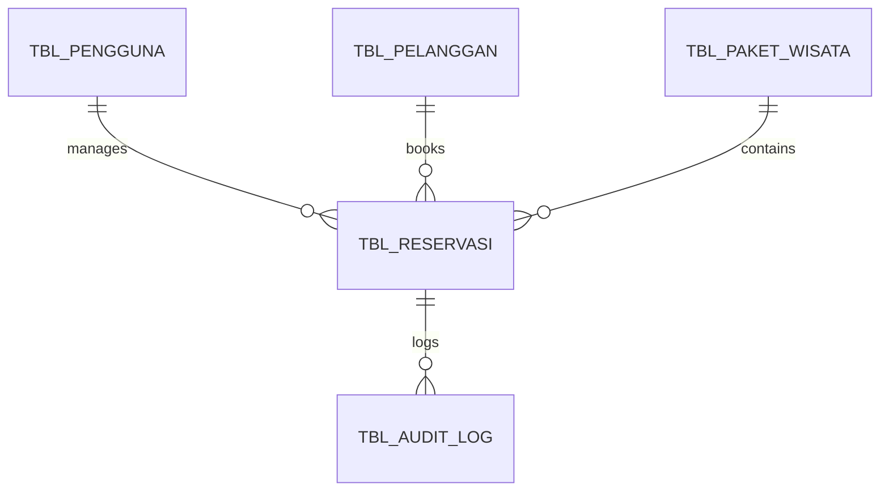

# 🛡️ Implementasi Keamanan Basis Data: Sistem Reservasi Paket Wisata

<div align="center">


 📊 Hasil Testing Lengkap

| Test ID | Test Case | Aspek Keamanan | User | Status | Hasil yang Diharapkan |
|---------|-----------|---------------|------|--------|----------------------|
| **A1** | Verifikasi Hashing | Autentikasi | admin | ✅ SUKSES | Password tersimpan sebagai hash SHA2(512), bukan plaintext |
| **A2** | Insert `jumlah_peserta = 0` | Integritas Data | admin/petugas | ❌ GAGAL | CHECK constraint mencegah data invalid |
| **B1** | UPDATE status reservasi | Otorisasi (petugas) | petugas_user | ✅ SUKSES | Petugas boleh update transaksi |
| **B2** | Verifikasi Audit Log | Audit & Akuntabilitas | petugas_user | ✅ SUKSES | Trigger mencatat user & timestamp |
| **B3** | UPDATE harga paket | Otorisasi (petugas) | petugas_user | ❌ GAGAL | Petugas tidak boleh ubah master data |
| **B4** | DROP TABLE | Otorisasi (petugas) | petugas_user | ❌ GAGAL | Petugas tidak punya hak DDL |
| **C1** | INSERT reservasi baru | Otorisasi (web_app) | web_app | ✅ SUKSES | Web app boleh buat reservasi baru |
| **C2** | UPDATE data pelanggan | Otorisasi (web_app) | web_app | ❌ GAGAL | Web app tidak boleh ubah data existing |
| **C3** | SELECT TBL_PENGGUNA | Otorisasi (web_app) | web_app | ❌ GAGAL | Web app tidak boleh akses data sensitif |

> **Catatan Penting:** 
> - ✅ **SUKSES** = Fungsi berjalan sesuai harapan (operasi berhasil atau security berfungsi)
> - ❌ **GAGAL** = Security bekerja dengan baik (mencegah operasi yang tidak diizinkan)
> 
> Kegagalan pada A2, B3, B4, C2, C3 adalah **hasil yang diinginkan** (security working as intended).=for-the-badge)


**Proyek Akhir Mata Kuliah Keamanan Basis Data**

*Mobile Commerce Tourism Reservation System dengan implementasi standar keamanan NIST & ISO 27001*

[📖 Dokumentasi](#-dokumentasi) •
[🚀 Quick Start](#-quick-start) •
[🔐 Fitur Keamanan](#-aspek-keamanan-yang-diimplementasikan) •
[🧪 Testing](#-skrip-simulasi-verifikasi)

</div>

---

## 📋 Daftar Isi

- [Tentang Proyek](#-tentang-proyek)
- [Latar Belakang](#-latar-belakang)
- [Aspek Keamanan](#-aspek-keamanan-yang-diimplementasikan)
- [Arsitektur Database](#-skema-basis-data)
- [Instalasi](#-instalasi)
- [Cara Penggunaan](#-cara-penggunaan)
- [Testing & Verifikasi](#-skrip-simulasi-verifikasi)
- [Kontributor](#-kontributor)

---

## 🎯 Tentang Proyek

Proyek ini mengimplementasikan dan mengevaluasi **aspek-aspek utama keamanan basis data** (Autentikasi, Otorisasi, Integritas, dan Audit) pada sistem reservasi paket wisata berbasis Mobile Commerce, sesuai dengan standar industri:

- ✅ **NIST SP 800-53** - Security and Privacy Controls
- ✅ **ISO 27001** - Information Security Management
- ✅ **OWASP Database Security** Best Practices

### 🎓 Tujuan Pembelajaran

Mengimplementasikan mekanisme keamanan di lapisan database (MySQL) untuk memastikan:
- **Kerahasiaan** (Confidentiality) - Perlindungan kredensial dan data sensitif
- **Integritas** (Integrity) - Konsistensi dan validitas data
- **Ketersediaan** (Availability) - Kontrol akses berbasis peran

---

## 🌟 Latar Belakang

Sistem Reservasi Paket Wisata berbasis **Mobile Commerce** sangat rentan terhadap ancaman keamanan seperti:

- 🚨 **SQL Injection** - Manipulasi query database
- 🔓 **Akses Tidak Sah** - Unauthorized access ke data sensitif
- 📊 **Penyalahgunaan Data** - Data breach dan privacy violation
- 🔄 **Inconsistent Data** - Kehilangan integritas referensial

Proyek ini mengatasi kerentanan tersebut dengan menerapkan **mekanisme keamanan berlapis** di level database MySQL, memastikan kerahasiaan, integritas, dan ketersediaan data transaksi reservasi wisata.

---

## 🔑 Aspek Keamanan yang Diimplementasikan

Proyek ini berfokus pada **empat pilar utama keamanan**, yang diimplementasikan secara langsung melalui skrip SQL (DDL, DML, DCL, Trigger):

| 🔐 Pilar Keamanan | 💻 Implementasi Teknis | 📝 Detail & Tujuan Keamanan |
|-------------------|------------------------|----------------------------|
| **1. Autentikasi** | `SHA2(512)` Password Hashing | Melindungi kredensial admin/petugas (`TBL_PENGGUNA`) dari kebocoran data. Password tidak tersimpan dalam plaintext. |
| **2. Otorisasi (Kontrol Akses)** | DCL (`GRANT`) & Prinsip Least Privilege | Membatasi hak akses setiap peran (`admin_user`, `petugas_user`, `web_app`) hanya pada tabel dan operasi yang diperlukan, mencegah akses berlebihan (NIST SP 800-53). |
| **3. Integritas Data** | `CHECK` Constraint & `FOREIGN KEY` | Menjaga kualitas data (contoh: `harga >= 0`, `jumlah_peserta > 0`) dan konsistensi relasi antar tabel. |
| **4. Audit & Akuntabilitas** | `TRIGGER` ke `TBL_AUDIT_LOG` | Mencatat setiap perubahan kritis pada transaksi (`UPDATE TBL_RESERVASI` status pembayaran), memberikan jejak audit (`pengguna_mysql` dan `waktu_aksi`) untuk akuntabilitas. |

### 🔒 Role-Based Access Control (RBAC)

```sql
-- Admin User: Full Control
GRANT ALL PRIVILEGES ON db_reservasi_wisata.* TO 'admin_user'@'localhost';

-- Petugas User: Manage Transactions & View Audit
GRANT SELECT ON db_reservasi_wisata.TBL_PENGGUNA TO 'petugas_user'@'localhost';
GRANT SELECT, INSERT ON db_reservasi_wisata.TBL_PELANGGAN TO 'petugas_user'@'localhost';
GRANT SELECT, INSERT, UPDATE ON db_reservasi_wisata.TBL_RESERVASI TO 'petugas_user'@'localhost';
GRANT SELECT ON db_reservasi_wisata.TBL_PAKET_WISATA TO 'petugas_user'@'localhost';
GRANT SELECT, INSERT ON db_reservasi_wisata.TBL_AUDIT_LOG TO 'petugas_user'@'localhost';

-- Web App: Limited Insert Access
GRANT SELECT ON db_reservasi_wisata.TBL_PAKET_WISATA TO 'web_app'@'localhost';
GRANT INSERT ON db_reservasi_wisata.TBL_RESERVASI TO 'web_app'@'localhost';
GRANT INSERT ON db_reservasi_wisata.TBL_PELANGGAN TO 'web_app'@'localhost';
```

## 📐 Skema Basis Data

Struktur utama sistem reservasi meliputi **5 tabel inti** dengan relasi terkelola:



| Tabel | Deskripsi | Fitur Keamanan |
|-------|-----------|----------------|
| `TBL_PENGGUNA` | Data user admin/petugas sistem | Password hashing SHA2(512), UNIQUE username |
| `TBL_PELANGGAN` | Data customer/wisatawan | UNIQUE email & telepon |
| `TBL_PAKET_WISATA` | Katalog paket wisata | CHECK constraint `harga >= 0` |
| `TBL_RESERVASI` | **Transaksi booking** (core) | CHECK `jumlah_peserta > 0`, Foreign key constraints, audit trigger |
| `TBL_AUDIT_LOG` | Log perubahan kritis | Auto-populated via trigger, mencatat USER() |

### 🗂️ Detail Struktur

<details>
<summary><b>Klik untuk melihat DDL lengkap</b></summary>

```sql
-- TBL_PENGGUNA: Autentikasi dengan SHA2
CREATE TABLE TBL_PENGGUNA (
    id_pengguna INT PRIMARY KEY AUTO_INCREMENT,
    username VARCHAR(50) NOT NULL UNIQUE,
    password_hash VARCHAR(128) NOT NULL,  -- SHA2(512)
    nama_lengkap VARCHAR(100),
    jabatan ENUM('Admin', 'Petugas_Reservasi', 'Pelanggan') NOT NULL,
    status ENUM('Aktif', 'Nonaktif') DEFAULT 'Aktif'
);

-- TBL_PELANGGAN
CREATE TABLE TBL_PELANGGAN (
    id_pelanggan INT PRIMARY KEY AUTO_INCREMENT,
    nama_pelanggan VARCHAR(100) NOT NULL,
    email VARCHAR(100) NOT NULL UNIQUE,
    telepon VARCHAR(15) NOT NULL UNIQUE,
    alamat TEXT
);

-- TBL_PAKET_WISATA: Integritas Data (CHECK Constraint)
CREATE TABLE TBL_PAKET_WISATA (
    id_paket INT PRIMARY KEY AUTO_INCREMENT,
    nama_paket VARCHAR(150) NOT NULL,
    deskripsi TEXT,
    durasi_hari INT NOT NULL,
    harga DECIMAL(10, 2) NOT NULL CHECK (harga >= 0),
    status_paket ENUM('Tersedia', 'Penuh', 'Arsip') DEFAULT 'Tersedia'
);

-- TBL_RESERVASI: Integritas dengan CHECK & FK
CREATE TABLE TBL_RESERVASI (
    id_reservasi INT PRIMARY KEY AUTO_INCREMENT,
    id_pelanggan INT NOT NULL,
    id_paket INT NOT NULL,
    tanggal_reservasi DATE NOT NULL,
    jumlah_peserta INT NOT NULL CHECK (jumlah_peserta > 0),
    total_biaya DECIMAL(10, 2) NOT NULL,
    status_pembayaran ENUM('Pending', 'Lunas', 'Batal') DEFAULT 'Pending',
    FOREIGN KEY (id_pelanggan) REFERENCES TBL_PELANGGAN(id_pelanggan),
    FOREIGN KEY (id_paket) REFERENCES TBL_PAKET_WISATA(id_paket)
);

-- TBL_AUDIT_LOG: Untuk Audit dan Akuntabilitas
CREATE TABLE TBL_AUDIT_LOG (
    id_log INT PRIMARY KEY AUTO_INCREMENT,
    tabel_terpengaruh VARCHAR(50),
    aksi VARCHAR(10), -- INSERT, UPDATE, DELETE
    data_lama TEXT,
    data_baru TEXT,
    waktu_aksi TIMESTAMP DEFAULT CURRENT_TIMESTAMP,
    pengguna_mysql VARCHAR(100) -- Mencatat siapa yang melakukan aksi
);
```

</details>

---

## 🚀 Quick Start

### � Instalasi

#### Prasyarat
- MySQL 8.0+ atau MariaDB 10.5+
- MySQL Client (Workbench / HeidiSQL / CLI)
- Hak akses `CREATE USER` dan `GRANT PRIVILEGE`

#### Langkah Instalasi

1. **Clone repository ini**
   ```bash
   git clone https://github.com/DimasVSuper/Sistem-reservasi-paket-wisata-pelayaran.git
   cd Sistem-reservasi-paket-wisata-pelayaran
   ```

2. **Import database**
   ```bash
   mysql -u root -p < db_reservasi_wisata.sql
   ```

3. **Verifikasi instalasi**
   ```sql
   SHOW DATABASES LIKE 'db_reservasi_wisata';
   SELECT User, Host FROM mysql.user WHERE User IN ('admin_user', 'petugas_user', 'web_app');
   ```

---

## 💻 Cara Penggunaan

### 1️⃣ Setup Database & Users

Jalankan skrip SQL utama sebagai **root**:

```bash
mysql -u root -p < db_reservasi_wisata.sql
```

Skrip ini akan otomatis:
- ✅ Membuat database `db_reservasi_wisata`
- ✅ Membuat 6 tabel dengan constraint keamanan
- ✅ Mengisi data sample (pelanggan, paket wisata)
- ✅ Membuat 3 user dengan privilege berbeda
- ✅ Setup trigger audit otomatis

### 2️⃣ Login sebagai User Spesifik

```bash
# Admin - Full Access (Password: StrongPassAdmin123!)
mysql -u admin_user -p db_reservasi_wisata

# Petugas - Limited Access (Password: StrongPassPetugas456!)
mysql -u petugas_user -p db_reservasi_wisata

# Web App - Read Only (Password: StrongPassWebApp789!)
mysql -u web_app -p db_reservasi_wisata
```

> **Catatan Keamanan:** Dalam implementasi production, password harus lebih kompleks dan disimpan dalam environment variables atau secret manager.

### 3️⃣ Test Operasi Database

```sql
-- Cek paket wisata tersedia (sebagai petugas_user atau web_app)
SELECT * FROM TBL_PAKET_WISATA WHERE status_paket = 'Tersedia';

-- Buat reservasi baru (sebagai petugas_user)
INSERT INTO TBL_RESERVASI (id_pelanggan, id_paket, tanggal_reservasi, jumlah_peserta, total_biaya)
VALUES (1, 2, '2026-01-15', 4, 3800000.00);

-- Update status pembayaran (trigger audit akan aktif - sebagai petugas_user)
UPDATE TBL_RESERVASI 
SET status_pembayaran = 'Lunas' 
WHERE id_reservasi = 1;

-- Verifikasi audit log (sebagai admin_user)
SELECT * FROM TBL_AUDIT_LOG ORDER BY waktu_aksi DESC LIMIT 5;
```

---

## 🧪 Skrip Simulasi (Verifikasi)

Skrip SQL terlampir mencakup **simulasi terstruktur** untuk memverifikasi bahwa Otorisasi dan Integritas telah bekerja:

### ✅ Test Case 1: Uji Kegagalan Integritas (A2)

**Tujuan:** Memverifikasi CHECK constraint bekerja

```sql
-- Login sebagai admin_user atau petugas_user
-- Harus GAGAL: jumlah_peserta = 0 (melanggar CHECK constraint)
INSERT INTO TBL_RESERVASI (id_pelanggan, id_paket, tanggal_reservasi, jumlah_peserta, total_biaya)
VALUES (1, 1, '2025-10-10', 0, 1000000.00);
```

**Expected Result:** ❌ `ERROR 3819 (HY000): Check constraint 'tbl_reservasi_chk_1' is violated`

**Penjelasan:** Constraint `CHECK (jumlah_peserta > 0)` mencegah data yang tidak valid masuk ke database.

---

### ✅ Test Case 2: Uji Kegagalan Otorisasi - Petugas (B3)

**Tujuan:** Memverifikasi Least Privilege Access - petugas tidak boleh ubah harga paket

```sql
-- Login sebagai petugas_user
mysql -u petugas_user -p
USE db_reservasi_wisata;

-- Harus GAGAL: tidak memiliki privilege UPDATE pada TBL_PAKET_WISATA
UPDATE TBL_PAKET_WISATA 
SET harga = 0.00 
WHERE id_paket = 1;
```

**Expected Result:** ❌ `ERROR 1142 (42000): UPDATE command denied to user 'petugas_user'@'localhost' for table 'TBL_PAKET_WISATA'`

**Penjelasan:** Petugas hanya memiliki hak SELECT pada `TBL_PAKET_WISATA`, tidak dapat mengubah data master paket wisata.

---

### ✅ Test Case 3: Uji Kegagalan Otorisasi - Web App (C2 & C3)

**Tujuan:** Memverifikasi isolasi data sensitif dari aplikasi web

```sql
-- Login sebagai web_app
mysql -u web_app -p
USE db_reservasi_wisata;

-- Test C2: Harus GAGAL - tidak boleh UPDATE data pelanggan lama
UPDATE TBL_PELANGGAN 
SET email = 'hacker@mail.com' 
WHERE id_pelanggan = 1;

-- Test C3: Harus GAGAL - tidak boleh akses TBL_PENGGUNA (data sensitif)
SELECT * FROM TBL_PENGGUNA;
```

**Expected Result:** 
- ❌ C2: `ERROR 1142 (42000): UPDATE command denied to user 'web_app'@'localhost' for table 'TBL_PELANGGAN'`
- ❌ C3: `ERROR 1142 (42000): SELECT command denied to user 'web_app'@'localhost' for table 'TBL_PENGGUNA'`

**Penjelasan:** Web app hanya boleh INSERT data baru (pelanggan dan reservasi), tidak boleh modifikasi data existing atau akses credential user internal.

---

### ✅ Test Case 4: Uji Keberhasilan Audit (B1 & B2)

**Tujuan:** Memverifikasi trigger audit logging mencatat semua perubahan kritis

```sql
-- 1. Login sebagai petugas_user dan update status reservasi (Test B1)
mysql -u petugas_user -p
USE db_reservasi_wisata;

UPDATE TBL_RESERVASI 
SET status_pembayaran = 'Lunas', total_biaya = 16000000.00 
WHERE id_reservasi = 3;

-- 2. Verifikasi log tercatat (Test B2) - bisa sebagai petugas atau admin
SELECT 
    id_log,
    waktu_aksi, 
    pengguna_mysql, 
    tabel_terpengaruh, 
    aksi,
    data_lama,
    data_baru
FROM TBL_AUDIT_LOG 
WHERE tabel_terpengaruh = 'TBL_RESERVASI'
ORDER BY id_log DESC 
LIMIT 1;
```

**Expected Result:** ✅ 
```
+--------+---------------------+-------------------------+-------------------+--------+
| id_log | waktu_aksi          | pengguna_mysql          | tabel_terpengaruh | aksi   |
+--------+---------------------+-------------------------+-------------------+--------+
|      1 | 2025-10-09 14:30:15 | petugas_user@localhost  | TBL_RESERVASI     | UPDATE |
+--------+---------------------+-------------------------+-------------------+--------+
```

**Penjelasan:** Trigger `tr_reservasi_update_log` otomatis mencatat perubahan status pembayaran/biaya, termasuk user MySQL yang melakukan perubahan untuk akuntabilitas penuh.

---

### 📊 Hasil Testing Lengkap

| Test ID | Test Case | Aspek Keamanan | User | Status | Hasil yang Diharapkan |
|---------|-----------|---------------|------|--------|----------------------|
| **A1** | Verifikasi Hashing | Autentikasi | admin | ✅ SUKSES | Password tersimpan sebagai hash SHA2(512), bukan plaintext |
| **A2** | Insert `jumlah_peserta = 0` | Integritas Data | admin/petugas | ❌ GAGAL | CHECK constraint mencegah data invalid |
| **B1** | UPDATE status reservasi | Otorisasi (petugas) | petugas_user | ✅ SUKSES | Petugas boleh update transaksi |
| **B2** | Verifikasi Audit Log | Audit & Akuntabilitas | petugas_user | ✅ SUKSES | Trigger mencatat user & timestamp |
| **B3** | UPDATE harga paket | Otorisasi (petugas) | petugas_user | ❌ GAGAL | Petugas tidak boleh ubah master data |
| **B4** | DROP TABLE | Otorisasi (petugas) | petugas_user | ❌ GAGAL | Petugas tidak punya hak DDL |
| **C1** | INSERT reservasi baru | Otorisasi (web_app) | web_app | ✅ SUKSES | Web app boleh buat reservasi baru |
| **C2** | UPDATE data pelanggan | Otorisasi (web_app) | web_app | ❌ GAGAL | Web app tidak boleh ubah data existing |
| **C3** | SELECT TBL_PENGGUNA | Otorisasi (web_app) | web_app | ❌ GAGAL | Web app tidak boleh akses data sensitif |

> **Catatan Penting:** 
> - ✅ **SUKSES** = Fungsi berjalan sesuai harapan (operasi berhasil atau security berfungsi)
> - ❌ **GAGAL** = Security bekerja dengan baik (mencegah operasi yang tidak diizinkan)
> 
> Kegagalan pada A2, B3, B4, C2, C3 adalah **hasil yang diinginkan** (security working as intended).

---

## 📚 Dokumentasi

### 📁 Struktur Proyek

```
Sistem-reservasi-paket-wisata-pelayaran/
│
├── db_reservasi_wisata.sql    # Main SQL script (DDL, DML, DCL, Triggers, Test Cases)
└── README.md                  # Dokumentasi proyek (file ini)
```

### 🔍 Isi File SQL Utama

File `db_reservasi_wisata.sql` berisi:

1. **DDL (Data Definition Language)** - Struktur 5 tabel dengan constraint keamanan
2. **DML (Data Manipulation Language)** - Data sample untuk testing
3. **DCL (Data Control Language)** - User creation & GRANT privileges (3 roles)
4. **Trigger** - Audit logging otomatis untuk akuntabilitas
5. **Test Cases** - 9 skenario pengujian (A1-A3, B1-B4, C1-C3)

> **Total:** ~400+ baris SQL lengkap dengan dokumentasi

### 🔗 Referensi

- [NIST SP 800-53 - Security Controls](https://csrc.nist.gov/publications/detail/sp/800-53/rev-5/final)
- [ISO/IEC 27001 - Information Security](https://www.iso.org/isoiec-27001-information-security.html)
- [OWASP Database Security Cheat Sheet](https://cheatsheetseries.owasp.org/cheatsheets/Database_Security_Cheat_Sheet.html)
- [MySQL 8.0 Security Guide](https://dev.mysql.com/doc/refman/8.0/en/security.html)
- [Sistem-Reservasi-Wisata-Pelayaran](https://www.researchgate.net/profile/Wildan-Wiguna-2/publication/341142990_Sistem_Reservasi_Paket_Wisata_Pelayaran_Menggunakan_Mobile_Commerce_di_Kota_Bandung/links/5eb0c00945851592d6b96151/Sistem-Reservasi-Paket-Wisata-Pelayaran-Menggunakan-Mobile-Commerce-di-Kota-Bandung.pdf)

---

## 👥 Kontributor

Proyek ini dikembangkan oleh:

- **Dimas Bayu Nugroho** - 12200497 - Database Administrator & Project Lead
- **[Nama Anggota 2]** - [NIM] - Security Implementation Specialist
- **[Nama Anggota 3]** - [NIM] - Testing & Documentation

### 🤝 Kontribusi

Jika Anda menemukan bug atau ingin berkontribusi:
1. Fork repository ini
2. Buat branch baru (`git checkout -b feature/improvement`)
3. Commit perubahan (`git commit -m 'Add some improvement'`)
4. Push ke branch (`git push origin feature/improvement`)
5. Buat Pull Request

---

## 📄 Informasi Akademik

- **Mata Kuliah:** Keamanan Basis Data
- **Program Studi:** Sistem Informasi
- **Universitas:** Universitas Bina Sarana Informatika
- **Tahun Akademik:** 2024/2025
- **Dosen Pengampu:** Ahmad Nouvel, S.Kom, M.Kom

---

## 📝 Lisensi

Proyek ini dibuat untuk keperluan akademik dan pembelajaran. Tidak diperuntukkan untuk penggunaan komersial.

---

<div align="center">

**⭐ Jika proyek ini membantu, berikan bintang di repository!**

Made with ❤️


</div>
